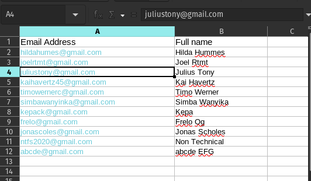

# Enterprise ETL Data Cleaning Pipeline

Data cleaning pipeline that ingests CSV or Excel files, validates and normalizes records, and produces reports and artifacts for downstream use.

## What it does

- Ingests CSV or Excel input files.
- Normalizes column names and applies validation rules.
- Supports streaming mode for large CSVs.
- Produces a report plus structured JSON and drop-reason artifacts.
- Caches run results for identical inputs and configuration.

## Architecture (high level)

```text
src/
  core/                 Config, logging, observability, and exceptions
  services/             Ingestion, validation, analysis, metrics, reporting
  models/               Pipeline metrics and report artifact types
  main.py               CLI entrypoint
config/                 thresholds.yaml, logging.yaml
```

## Inputs

- CSV: `.csv`
- Excel: `.xlsx` or `.xls` (converted to CSV before processing)

Excel sheet selection:

- `EXCEL_SHEET_MODE=combine_sheets` combines all sheets and adds `source_sheet`.
- `EXCEL_SHEET_MODE=first_sheet` or `single_sheet` loads one sheet.
- `EXCEL_SHEET_NAME` optionally selects a specific sheet when in single-sheet mode.

## Outputs

Reports and artifacts are written under `data/`:

- `data/reports/analysis_report_<run_id>.xlsx` (or `.csv` / `.parquet` depending on `REPORT_FORMAT`)
- `data/reports/drop_reasons_<run_id>.csv`
- `data/reports/pipeline_summary_<run_id>.json`
- `data/exports/cleaned_<run_id>.csv` or `data/exports/cleaned_stream_<run_id>.csv` when cleaned data is exported

The drop-reasons CSV contains per-reason counts and percentage shares of dropped rows.
The JSON summary includes run metadata, alert flags, validation counts, and artifact paths.

## Screenshots




## Idempotent run cache

The pipeline caches results in `tmp/run_cache.json`. If the input file hash and relevant configuration values match a previous run, the pipeline returns the cached artifact paths without reprocessing.

To force a re-run, delete `tmp/run_cache.json` or change the input file or configuration.

## Configuration

Required:

- `DATA_FILE` (path to the CSV/XLSX/XLS input file)

Optional (selected):

- `ENABLE_STREAMING_FOR_CSV` (default: true)
- `CSV_CHUNK_SIZE`
- `STREAM_FILE_SIZE_MB_THRESHOLD`
- `REQUIRED_COLUMNS` (comma-separated)
- `REPORT_FORMAT` (`excel`, `csv`, `parquet`)
- `REPORT_MODE` (`minimal`, `standard`, `detailed`)
- `MAX_REPORT_ROWS`
- `INCLUDE_CLEANED_DATA_IN_REPORT`
- `ENABLE_EXCEL_FORMATTING`
- `EXCEL_SHEET_MODE`, `EXCEL_SHEET_NAME`
- `LOG_LEVEL`, `JSON_LOGS`
- SMTP settings (`SMTP_SERVER`, `SMTP_PORT`, `SMTP_USER`, `SMTP_PASSWORD`, `SENDER_EMAIL`, `RECIPIENT_EMAIL`)
- Observability (`SENTRY_DSN`, `OTEL_EXPORTER_OTLP_ENDPOINT`)

See `.env.example` for the full list.

## Required files

The pipeline checks for these files at startup:

- `config/thresholds.yaml`
- `config/logging.yaml`

Missing files cause startup to exit with a non-zero status.

## Install

```bash
python -m venv .venv
source .venv/bin/activate
pip install -r requirements-dev.txt
```

## Run

```bash
PYTHONPATH=. python -u src/main.py
```

The command prints JSON to stdout with the run ID and artifact paths.

## Docker

```bash
docker build -t enterprise-etl:latest -f docker/Dockerfile .
```

```bash
docker run --rm --env-file .env \
  -v "$(pwd)/data:/app/data" \
  -v "$(pwd)/logs:/app/logs" \
  enterprise-etl:latest
```

## Tests

```bash
pytest
```

```
pytest tests/unit/test_reporting_service.py
pytest tests/integration/test_pipeline_runner.py
```
